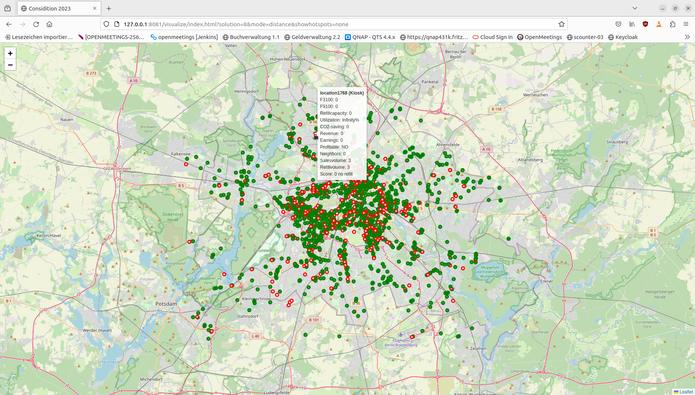
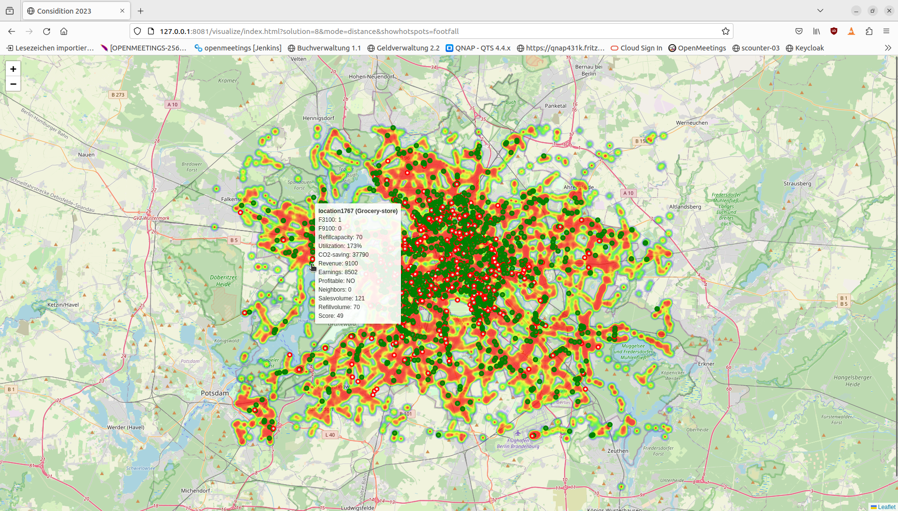
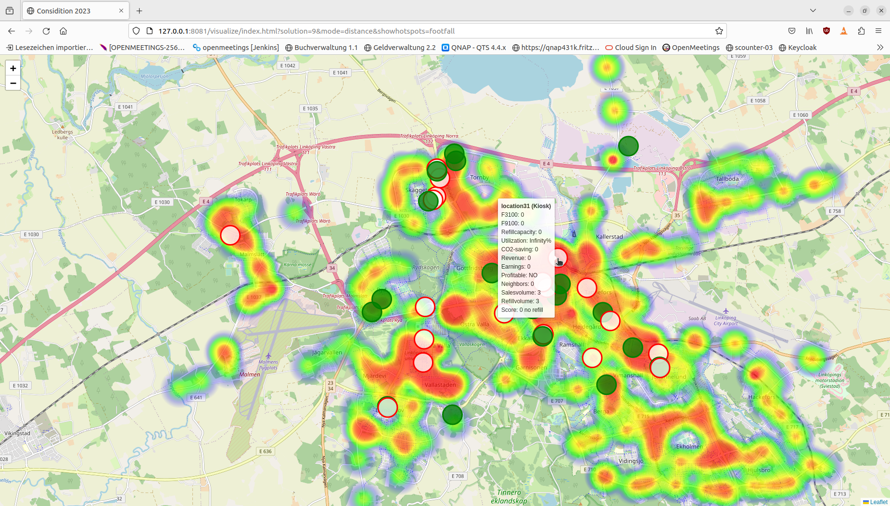
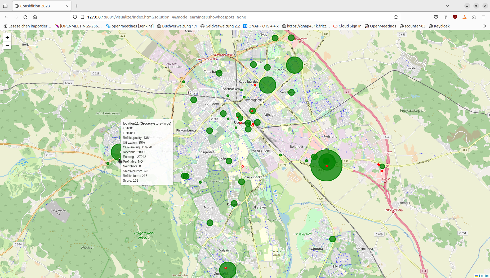

# Visualizer

Version: 2023-11-24

Visualizes the solutions of the **considition2023** on an **openstreetmap**.

## Screenshots

## Start

**nodejs** and **npx** must be installed.

cd visualize
./http.start

URLs

http://localhost:**PORT**/visualize/index.html?solution=**ID**&mode=**MODE**&showhotspots=**HOTSPOT**

**PORT** 
The port shown after **http.start**

**ID** 
One of the challenges 1-11 - you need a file my_games/m**ID**.json for the map and my_games/s**ID**.json for the solution.

**MODE**

when a shown figure is <0 a white circle with border is show,
The size of the circle represents the figure.

- distance: show the willingDistance around the location
- units:  The # of units
- revenue: The revenue
- earning: The earnings 
- sales: The salesVolume
- co2: The co2Savings
- neighbors: # neighbors in willingDistance
- total: The totalScore for the location  

**HOTSPOT**

- none:  no hotspots shown
- footfall: show footfall of hotspots als blur
- spread: show spread of hotspots as blur 